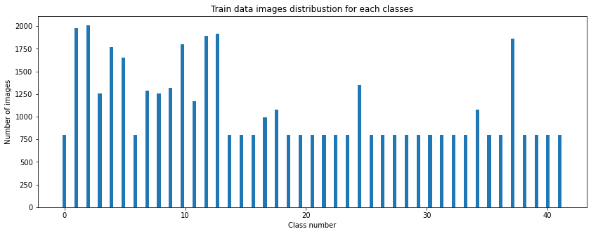

Deep Learning
---
## Project: Build a Traffic Sign Recognition Classifier
[](http://www.udacity.com/drive)

Dataset Summary & Exploration
---

This dataset includes German traffic signs. Following is the summary of the data set.

Summary |       |
----------------------------|----|
Number of training examples |34799 |
Number of testing examples |2630 |
Image data shape |(32, 32, 3)|
Number of classes |43|

### Exploratory visualization of the dataset

Following are the sample images for the dataset.

  

Following is the histogram for labels vs frequency distribution

  

**Min number of image per class:  180**    
**Max number of image per class:  2010**


Design and Test a Model Architecture
---

#### Pre-process the dataset 

Grayscale and normalization techniques were used to pre-process image data for the image processing pipeline.
For grayscale following snippets were used.

```python
# Graysscale the images - train set
X_train_rgb = np.copy(X_train)
X_train_gray = np.sum(X_train / 3, axis=3, keepdims=True)

# Graysscale the images - test set
X_test_rgb = np.copy(X_test)
X_test_gray = np.sum(X_test / 3, axis=3, keepdims=True)

# Graysscale the images - valid set
X_valid_rgb = np.copy(X_valid)
X_valid_gray = np.sum(X_valid / 3, axis=3, keepdims=True)

```

For normalization following snippets were used.

```python
# Normalize train values
X_train_normalize = (X_train - 128) / 128
# Normalize test values
X_test_normalize = (X_test - 128) / 128
# Normalize valid values
X_valid_normalize = (X_valid - 128) / 128

```

Following is a sample result for grayscale images.


###### Discussions: Data Preprocessing

* Grayscaled RGB images to reduce three color channels to one channel. This will reduce CNN training time, and it'll help to identify edges clearly
* Normalized image data into the range [-1, 1]. If we didn't scale our input training vectors, the ranges of our distributions of feature values would likely be different for each feature, and thus the learning rate would cause corrections in each dimension that would differ from one another. We might be over compensating a correction in one weight dimension while undercompensating in another.

##### Image Data Augmentation
Image data augmentation is a technique that can be used to artificially expand the size of a training dataset by creating modified versions of images in the dataset. Following image processing techniques will be used to augmentations for images. Following common augmentation techniques will be used to do image data augmentation.


###### Translation

```python
def random_translate(img):
    """
    This is used to apply linear transfomation followed by vector addition(translation). Also this technique
    is called as Affine transform.
    https://docs.opencv.org/4.4.0/d4/d61/tutorial_warp_affine.html
    
    :param img - grayscale and normalized image
    """
    h,w = img.shape[:2]
    
    # allow translation up to px pixels in x and y directions
    px = 2
    dx,dy = np.random.randint(-px,px,2)

    M = np.float32([[1,0,dx],[0,1,dy]])
    dst = cv2.warpAffine(img,M,(w,h))
    
    return dst[:,:,np.newaxis]
    
```

###### Scaling

```python
def random_scaling(img):   
    """
    This is used to gerate new scaled images.
    
    :param img - grayscale and normalized image
    
    """
    h,w = img.shape[:2]

    # transform limits
    px = np.random.randint(-2,2)

    # ending locations
    pts1 = np.float32([[px,px],[h-px,px],[px,w-px],[h-px,w-px]])

    # starting locations (4 corners)
    pts2 = np.float32([[0,0],[h,0],[0,w],[h,w]])
    M = cv2.getPerspectiveTransform(pts1,pts2)
    dst = cv2.warpPerspective(img,M,(h,w))
    
    return dst[:,:,np.newaxis]
    
```

###### Warping

```python
def random_warp(img):
    """
    This is ued to do warp images and affine transformation technique is used to generate image mstrix.
    
    :param img - grayscale and normalized image
    """
    h,w = img.shape[:2]
    # random scaling coefficients
    dx = np.random.rand(3) - 0.5
    dx *= w * 0.06   # this coefficient determines the degree of warping
    dy = np.random.rand(3) - 0.5
    dy *= h * 0.06
    # 3 starting points for transform, 1/4 way from edges
    x1 = w/4
    x2 = 3*w/4
    y1 = h/4
    y2 = 3*h/4
    pts1 = np.float32([[y1,x1],
                       [y2,x1],
                       [y1,x2]])
    pts2 = np.float32([[y1+dy[0],x1+dx[0]],
                       [y2+dy[1],x1+dx[1]],
                       [y1+dy[2],x2+dx[2]]])

    M = cv2.getAffineTransform(pts1,pts2)
    dst = cv2.warpAffine(img,M,(w,h))
    
    return dst[:,:,np.newaxis]
```

###### Brightening 

```python
def random_brightness(img):
    """
    This is used to change brightness randomly.
    
    :param img - grayscale and normalized image
    """
    shifted = img + 1.0   # shift to (0,2) range
    img_max_value = max(shifted.flatten())
    max_coef = 2.0/img_max_value
    min_coef = max_coef - 0.1
    coef = np.random.uniform(min_coef, max_coef)
    dst = shifted * coef - 1.0
    
    return dst
    
``` 

Here is a sample augmented image


###### Discussions:  Data augmentation

Data augmentation increased accuracy of the model because several classes in the data have far fewer samples than others. The model will tend to be biased toward those classes with more samples. I generated augmented images for classes that's frequencies less than or equal to 800.

And the following is the new training data distribution for each class.




#### Model Architecture


Following is the Python implementation for CNN model architecture.

```python
# Create a some wrapper
def conv2d(x, W, b, stride=1):
    # Conv2D wrapper, with bias and relu activation
    x = tf.nn.conv2d(x, W, strides=[1, stride, stride, 1], padding='VALID')
    x = tf.nn.bias_add(x, b)

    return tf.nn.relu(x)
```

```python
def maxpoll2d(x, k=2):
    # Maxpool2D wrapper
    return tf.nn.max_pool(x, ksize=[1, k, k, 1], strides=[1, k, k, 1], padding='VALID')
    
```

```python
random_normal = tf.initializers.RandomNormal(mean=mu, stddev=sigma)
weights = {
    'wc1': tf.Variable(random_normal([5, 5, 1, 6])),
    'wc2': tf.Variable(random_normal([5, 5, 6, 16])),
    'wd1': tf.Variable(random_normal([5, 5, 16, 400])),
    'out': tf.Variable(random_normal([800, 43]))
}

biases = {
    'bc1': tf.Variable(tf.zeros(6)),
    'bc2': tf.Variable(tf.zeros(16)),
    'bd1': tf.Variable(tf.zeros(400)),
    'out': tf.Variable(tf.zeros(43))
}

```

```python
# CNN Architecture
def conv_net(x):
    # Convolution layer. Output shape: [-1, 32, 32, 32]
    x = tf.reshape(x, [-1, 32, 32, 1])
    # new_size = (input_size - filter_size + 2 x padding_size )/ stride +1
    # (32 - 5 + 2 * 0)/1 +1 = 27  +1 = 28
    # 5 x 5 fiter 6
    # new shape = 28 x 28 x 6
    # Convolution layer, input shape:[-1,32,32,1]. Output shape: [-1, 28, 28, 6]
    x = conv2d(x, weights['wc1'], biases['bc1'])
    # Max pooling(down sampling), input shape[-1,28,28,6]. output shape [-1, 14,14,6]
    x = maxpoll2d(x, k=2)
    
    # Convolution layer, input shape: [-1,14,14,6]. Output shape: [-1, 10,10, 16]
    x = conv2d(x, weights['wc2'], biases['bc2'])

    # Max pooling(down sampling), input shape[-1,10,10,16]. output shape [-1, 5,5,16]
    x = maxpoll2d(x, k=2)
    layer2 = x

    # Convolution layer. Output shape: [-1, 1, 1, 400]
    x = conv2d(x, weights['wd1'], biases['bd1'])

    # Flatten layer
    l2_flat = flatten(layer2)
    x_flat = flatten(x)
    # Concatanate flattened layers to single size 800 layer
    res = tf.concat(values=[l2_flat, x_flat], axis=1)
    
    # Apply dropout
    x = dropout(res, training=True)

    # Fully connected layer, output shape [-1, 43]
    out = tf.add(tf.matmul(x, weights['out']), biases['out'])

    # Apply softmax to normalize the logists to a probability distribution
    return tf.nn.softmax(out)
``` 


###### Discussions: Model Architecture

This architecture was selected after evaluation LeNet lab session and after playing it with different hyperparameters. This was performed well without a GPU environment and the time is taken to train this model is quite less. Following are layers and activations.

01. 5x5 convolution layer1 (32x32x1 in, 28x28x6 out)
02. ReLU activation
03. 2x2 max pool layer1 (28x28x6 in, 14x14x6 out)
04. 5x5 convolution layer2 (14x14x6 in, 10x10x16 out)
05. ReLU activation
06. 2x2 max pool layer2 (10x10x16 in, 5x5x16 out)
07. 5x5 convolution layer3 (5x5x6 in, 1x1x400 out)
08. ReLu activation
09. Flatten layers from numbers 8 (1x1x400 -> 400) and 6 (5x5x16 -> 400)
10. Concatenate flattened layers to a single size-800 layer
11. Dropout layer
12. Fully connected layer (800 in, 43 out)

###### Discussion: Model Training

Adam optimizer was used for gradient optimization, and I trained many times with different hyperparameters and different augmented data. Following are last trained hyperparameters. Also, I uploaded my final train dataset to  [G-drive](https://drive.google.com/file/d/1ZXq4mr5SYKbAs-9lFElq9AEcP1y4Vc4s/view?usp=sharing) (this is compressed using gzip, need to be uncompressed before use it) for further verification for my validation set accuracy.  

Following are final hyperparameters.

* epoches = 50
* batch_size = 130
* learning_rate = 0.0009
* optimizer = Adam
* dropout = 0.52
* mu = 0.0
* sigma = 0.1


###### Discussion: Solution Approach

Here I used Tensorflow2 eager approach to train the model and did not save the trained model. The accuracy of the `validation` test was **0.934921**. I have played Udacity lab sessions and learned some other techniques from publicly available resources(I will include these references in the reference section). I had to train this model a hundred times to tune parameters since this is a low-level approach, and I did not use other supportive hyperparameters tune techniques for this project. Last run logs can be found [here](final_trained_logs.txt).

Test a Model on New Images
---

Following are the selected new images for testing.


Following are the preprocessed test images.


###### Discussions: Acquiring New Images

I selected five German road traffic images to test with the trained model. And also I selected the top three guesses from predicted labels.

###### Discussions: Performance on New Images

Among the top three guesses only top one guess was predicted with **100%** and the other two was predicted with **0%** accuracy. Following are the results for selected test images.


###### Discussions: Model Certainty - Softmax Probabilities

This very high level of certainty, along with achieving **100%** accuracy, on the newly introduced real-world data is indicative of a model that performs very well. Following are the softmax probabilities and plots for top five predicted labels.


References
---
* https://www.udacity.com/course/introduction-to-computer-vision--ud810
* https://www.udacity.com/course/self-driving-car-engineer-nanodegree--nd013
* http://cs231n.stanford.edu/
* https://deeplearning.mit.edu/
* https://www.youtube.com/watch?v=iaSUYvmCekI
* https://www.youtube.com/watch?v=DAOcjicFr1Y
* https://machinelearningmastery.com/how-to-configure-image-data-augmentation-when-training-deep-learning-neural-networks/
* https://stats.stackexchange.com/questions/185853/why-do-we-need-to-normalize-the-images-before-we-put-them-into-cnn
* https://curiousily.com/posts/image-data-augmentation-for-tensorflow-2-keras-and-pytorch-with-albumentations-in-python/
* https://en.wikipedia.org/wiki/Histogram_equalization
* http://graphics.cs.cmu.edu/courses/15-463/2004_fall/www/Lectures/filtering1.pdf
* https://docs.opencv.org/4.4.0/d4/d61/tutorial_warp_affine.html
* https://github.com/jeremy-shannon/CarND-Traffic-Sign-Classifier-Project


Acknowledgments
---
Big thank you to [Udacity](https://www.udacity.com) for providing the template code for this project.

